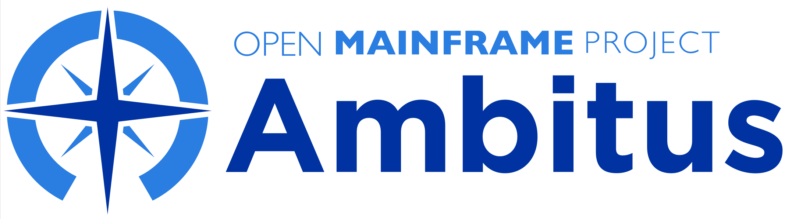

# Ambitus

The Ambitus project is a community for developers of open source software for z/OS or Linux on IBM Z.  The repositories here accommodate teams working on larger projects, while smaller efforts may be a hosted in the [pyzkiln](https://github.com/ambitus/pyzkiln)

repository.  Developers, data scientists, Linux system administrators, and traditional z/OS system programmers may all find resources to use here.

Key repositories in this organization include:

- [AI on Z Solution Templates](https://github.com/ambitus/aionz-solution-templates)
- [cbexplorer](https://github.com/ambitus/cbexplorer) - z/OS control block explorer
- [pyracf](https://github.com/ambitus/pyracf) - Python interface to RACF
- [pyzkiln](https://github.com/ambitus/pyzkiln) - A collection of Python building blocks
- [ztron](https://github.com/ambitus/zml) - A lightweight automation and logging
pipeline for z/OS
- [zml](https://github.com/ambitus/zTron) - Z markup language specification

Documentation and reference information can be found in the [doc](./doc/README.md)

We have several friends and social groups in the mainframe community that you might
like to connect to as well:

- The [System Z Enthusiasts](https://discord.com/servers/system-z-enthusiasts-880322471608344597) Discord channel
- [Therapod Blog](https://medium.com/theropod) on Medium
- [Terminal Talk podcast](https://www.terminaltalk.net/) - Frank and Jeff talk
with members of the mainframe community
- [TFiR Mainframe Matters](https://youtube.com/playlist?list=PLqJap3FMiIH8vb5pi1InruLFZouPGdz_M&si=A-kTWRUBIYWZtKXu) - from TFiR Media
- [z/OS Open Tools](https://github.com/ZOSOpenTools/) - for ported infrastructure and tooling on z/OS

## Contributing

You can contribute to any of the porting efforts following the contribution policies defined in each repository.

All tooling can be contributed to using the guidelines at [CONTRIBUTING.md](CONTRIBUTING.md)

## License

All ports retain the license of their respective upstream projects.

All tooling is licensed under the [Apache 2 license](https://spdx.org/licenses/Apache-2.0.html), and any documentation and non-code will be received and made available under the [Creative Commons Attribution 4.0 International License](http://creativecommons.org/licenses/by/4.0/).

## Governance

Ambitus is a project hosted by the [Open Mainframe Project](https://openmainframeproject.org). This project has established it's own processes for managing day-to-day processes in the project at [GOVERNANCE.md](GOVERNANCE.md).

## Reporting Issues

To report a problem, you can open an issue in respective repository. If the issue is sensitive in nature or a security related issue, please do not report in the issue tracker but instead email [ambitus-private@lists.openmainframeproject.org](ambitus-private@lists.openmainframeproject.org)

For ports at the Upstreamed stage, please report any issues to the respective upstream project.
